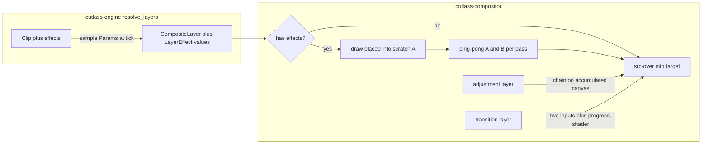

# Effects roadmap — M4 effect engine & transitions

The GPU rendering substrate for everything visual that isn't a plain clip:
a per-layer effect chain, real adjustment layers, transitions at clip
junctions, a starter pack of effects/transitions, agent vocabulary, and the
Effects UI. This document is the feature-area plan for `v1-roadmap.md` § M4
and reuses the `Param` system from M2 (`keyframes-roadmap.md`).

## Status legend

- [x] shipped
- [ ] not started / in progress

---

## Design (decisions up front)

- **Effects are data**: `EffectInstance { effect_id: String, params:
  Map<String, Param<f32>> }` on `Clip` (`cutlass-models/src/clip.rs`),
  additive serde (no schema bump from v2 — `#[serde(default,
  skip_serializing_if)]`). A static **effect catalog** (id, label, param
  specs: name/label/default/min/max) lives in `cutlass-models/src/effects.rs`
  so commands validate and the UI browses; the compositor owns the WGSL.
- **Render shape**: layers without effects keep the single-pass src-over
  path untouched (zero regression). A layer *with* effects renders
  placed-but-full-opacity into a canvas-sized scratch texture, ping-pongs
  through its passes (two scratch textures reused across every layer in the
  frame), then blends into the accumulating target at the layer's opacity.
  The engine samples all `Param`s at the tick — the compositor only ever
  sees plain `f32` values, never `Param`s.
- **Adjustment layers** = the same chain applied to the **accumulated
  canvas**: an active adjustment clip closes the current pass, ping-pongs the
  canvas itself through the chain, then stacking continues above (CapCut
  semantics).
- **Transitions** = `Transition { left: ClipId, right: ClipId,
  transition_id, duration }` stored per `Track` (additive serde field). The
  window is centered on the junction; the engine resolves *both* clips'
  frames (source sampling clamps at media bounds — no clip repositioning) and
  emits a dual-input `CompositeLayer`; a transition registry (two textures +
  a progress uniform) renders it. A junction renders only while the pair
  still abuts; structural edits (trim/move/split/remove/ripple) prune dead
  junctions inside their own history group, so undo restores them.

## Phase 1 — Compositor effect graph + golden-frame harness ✅

- [x] **`EffectRegistry`** (`cutlass-compositor/src/effects.rs`): effect id →
      ordered pass list (WGSL fs + uniform layout), pipelines lazily created
      and cached on the `Compositor` beside the existing solid/blit/yuv trio.
- [x] **`CompositeLayer.effects: Vec<LayerEffect { effect_id, values }>`**
      (`layer.rs`); ping-pong scratch targets cached on the compositor.
- [x] **Two proving effects**: gaussian blur (separable, multi-pass — proves
      N-pass) and vignette (single pass).
- [x] **Golden-frame harness** (`tests/golden_frames.rs`): deterministic
      fixture frame → effect at fixed params → compare PNG with ±tolerance,
      `BLESS_GOLDEN=1` to regenerate, graceful no-GPU skip.
- [x] **Criterion bench per effect** in `benches/composite.rs`; the
      no-effects path stays the baseline.

## Phase 2 — Model, commands, agent tools ✅

- [x] **`EffectInstance` + catalog**; `Clip.effects`; split copies effects to
      both halves (same as crop).
- [x] **Commands** `AddEffect` / `RemoveEffect` / `SetEffectParam` →
      dispatch → `action/edit/` modules with clip-snapshot inverses;
      validation against the catalog (id exists, param known, value in
      range).
- [x] **Keyframing**: effect params address as `ClipParam::Effect { effect,
      param }` through the existing `SetParamKeyframe` / `RemoveParamKeyframe`
      path — no new command surface.
- [x] **`resolve_layers`** samples each param at the clip-relative frame tick
      → `LayerEffect` values.
- [x] **Agent** (schema → **v9**): `add_effect` / `remove_effect` /
      `set_effect_param` wire DTOs + validation + `describe_action` arms +
      `describe_project` per-clip effect listing + eval case.

## Phase 3 — Starter effect pack ✅

- [x] Eight more effects: **sharpen, pixelate, glitch, chromatic aberration,
      grain, glow, zoom-blur, mirror** — catalog entries with sensible
      ranges/defaults, one golden frame and one bench each. (Ten effects
      total with Phase 1's blur + vignette.)

## Phase 4 — Adjustment layers become real ✅

- [x] Adjustment clips carry the same `effects` chain; `resolve_layers` stops
      skipping them and emits an apply-to-canvas-below layer; the compositor
      splits the pass and ping-pongs the accumulated canvas.
- [x] Adjustment lanes un-hidden in `projection.rs` (`kind_visible`).
- [x] Golden test: an adjustment over a two-layer stack affects the layers
      below it, the clip above it is untouched.

## Phase 5 — Transitions ✅

- [x] **Model**: `Transition` on `Track` (additive serde); abutment
      detection via ordered-clip windows; prune rules wired into
      trim/move/split/remove/ripple (compound inverse restores pruned
      junctions on undo).
- [x] **Commands** `AddTransition` / `RemoveTransition` / `SetTransition` +
      inverse tests; agent tools + describe + eval (schema **v10**).
- [x] **Engine**: dual-frame resolution in the window (both clips sampled at
      clamped source times); new dual-input `CompositeLayer::Transition`
      variant.
- [x] **Transition registry + starter set**: crossfade, dip-to-black,
      dip-to-white, wipe L/R/U/D, slide, zoom, blur. Golden frames at the
      midpoint, plus a guard that every transition changes the mid frame.

## Phase 6 — UI ✅ (with deliberate gaps, below)

- [x] **Library**: Effects and Transitions tabs restored, backed by the
      model catalogs; a `CatalogTile` applies on click to the current
      selection — effects onto the selected clip, transitions at its right
      junction (tiles disabled with a hint when nothing is selected).
- [x] **Inspector Effects section**: one removable block per effect with a
      slider + numeric readout per scalar parameter; release commits one
      undoable `SetEffectParam`, values re-sync from the projection.
- [x] **Timeline**: a transition pill centered on each junction in content
      space, with an edge-drag resize (symmetric, one `SetTransition` on
      release) and a remove control.
- [x] **Plumbing**: `EffectsBackend` global, `WorkerMsg` variants, `main.rs`
      wiring, and the projection extension (clip effects, track transitions)
      — the `SetClipCrop` flow end-to-end.

## Phase 7 — Docs & close-out ✅

- [x] This document, CHANGELOG entries, M4 ticks in `v1-roadmap.md`, and the
      `timeline-roadmap.md` Phase 11 update.
- [x] Full workspace `cargo test` + composite benches to confirm the
      no-effects path didn't regress.

---

## Deliberate gaps (follow-ups)

These were scoped out of M4 to keep the milestone shippable; the engine and
agent already support them, so they're UI-only follow-ups:

- **Library drag-onto-clip / drop-targets.** The plan's
  `DragBackend.resolve-effect-drop` (hovered-clip hit-test for effects,
  abutting-junction targeting for transitions) is unbuilt; the current flow
  is **click-to-apply against the timeline selection**, which is functional
  and unambiguous. Reusing the `library-drag-*` state machine for effect
  payloads is the natural next step (`timeline-roadmap.md` Phase 11).
- **Inspector keyframe diamonds for effect params.** Effect-param keyframing
  exists in the engine (`ClipParam::Effect` through the M2 command path), but
  the inspector renders plain constant-value sliders rather than the
  `TransformRow` + `KeyframeControl` cluster. Wiring per-playhead effect
  sampling and the diamond cluster is the remaining piece.
- **Hover-preview on effect tiles** (the `GeneratorOverride`-style temporary
  override) — a stretch goal, not implemented.
- **Transition params beyond duration.** The model/agent surface is
  duration-only today; per-transition params (e.g. wipe softness) reuse the
  same `Param` path when added.
